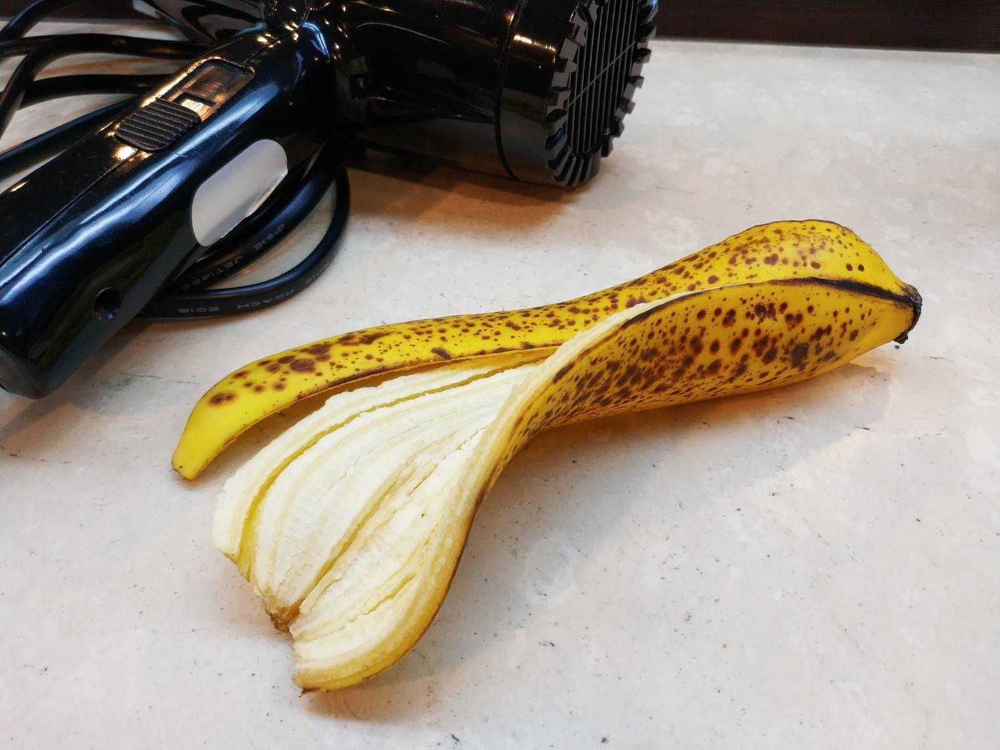
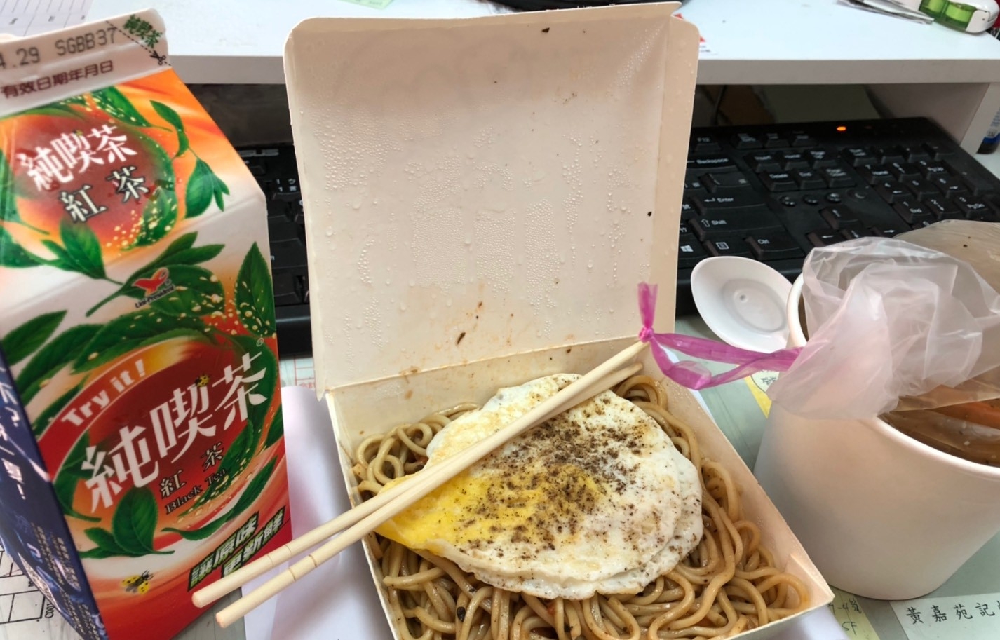
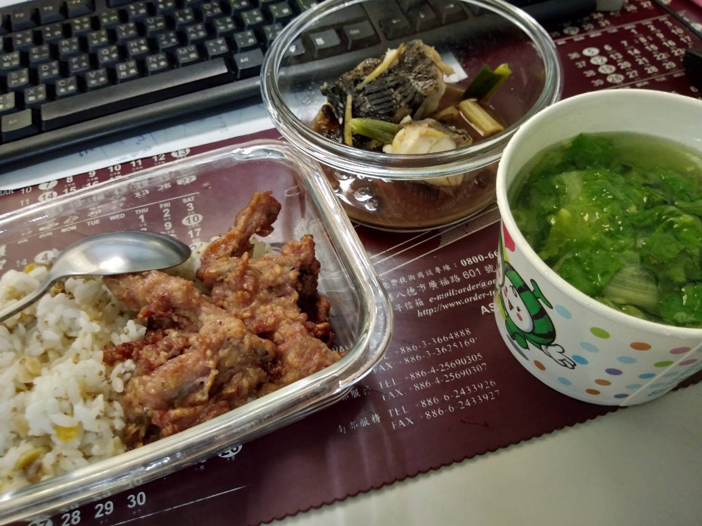

> 我們致力於相互鼓勵追求理想身裁，以提升生活品質，歡迎[您點此按讚追蹤更多實用資訊](https://flyis.me/fffb)，或[點此報名加入計劃](https://flyis.me/joinfit)

所謂原型食物(Whole food)是指你「看得出它原來是長什麼樣子的食物」，這些東西並不需要被標示「成份」，例如蔬菜、雞胸肉、堅果、雞蛋等。

相同熱量下，原型食物的體積通常較大，較有飽足感。吃了比較不會那麼快就覺得餓。要減重的話可以形成一種良性循環。

以原型食物為主的餐食通常含有較多蛋白質，可以幫助人體組織修復、肌肉增長，而且蛋白質比例高，也較容易有飽足感。

此外，通常含有較多纖維，纖維是維持腸道運作的重要成分，除了增加飽足感外，排便順暢與否就靠它了。

原型食物含有較多營養素，例如各種維生素、礦物質等。

食品添加物在怎麼添加，也沒有大自然創造出來的食物營養這麼全面和完整。

健身前，我最喜歡的食物是香蕉。他好攜帶，又營養，可以快速提供能量，也不會造成消化不良。

我在吃香蕉的時候，會多吃一些皮肉間的纖維，這樣子對於消化更有幫助。而且香蕉很甜，配著粗一點纖維來變化口感，能豐富吃它的趣味。

健身後，我最喜歡的食物是雞蛋與雞胸肉，都是很好補充蛋白質的好食物。使用微波爐來料理，更能讓我在幾分鐘內，就把肌肉在訓練中的損耗補上，一般健身的人說法是在半小時內，而24小時內也要持續補充蛋白質。

雞蛋在我苦悶的健身料理中，可能是唯一的曙光創世級食材了。翻翻食譜，都可以發現有成千上百種料理方式。我可以加水變蒸蛋，我可以加泡麵，呃，這其實不是很健康，但他就升級成了營養一點的泡麵。我可以加他巧克力牛奶，加他燕麥片，加他堅果，變成巧克力蛋糕， 換成香蕉就是香蕉蛋糕。要增強南洋風味，加椰子油。要回覆體力，可以加他薑黃跟胡椒粉，能幫助消炎。最近我更嚐試加入[**大馬士革玫瑰**](https://flyis.me/2vgLjPl)，貴婦感…不，貴公子感油然而升，吃起來有迷人花香， 花瓣的纖維，也能幫助消化。蛋的料理方式超級豐富，都值得大家一試，歡迎分享。

<Embed src="https://www.youtube.com/embed/kT_tp-jYUUQ?feature=oembed" aspectRatio={0.562} />

### 噹噹噹，今日任務

請大家也來談談自己方便吃的到的原型食物吧

例：蛋，雞胸，香蕉，奇異果

每都我們都來看看自己今天吃了幾樣，和加工食物比例如何？

以下是[理想身裁設計社群成員](http://flyis.me/joinfit)在 4/21的午餐閒話，你是不是常常忙得不可開交呢？可以效法我們成員，提前一天準備好自己的餐點，或者，再忙也要加上點原型食物來升級飲食品質哦！

---

### 一號餐/純茶蛋麵：目測原型比例 15%

### 二號餐/魚肉菜民：目測原型比例 75%

### 三號餐/忙裡加蛋菜：目測原型比例 30%

---

### **歡迎加入理想身裁設計社群**

我們致力於相互鼓勵追求理想身裁，以提升生活品質，歡迎[您點此按讚追蹤更多實用資訊](https://flyis.me/fffb)，或[點此報名加入計劃](https://flyis.me/joinfit)

參考資訊來源

-   [不賴的理想身裁設計藍圖](http://flyis.me/x421)
-   只要一個飲食小改變，顯瘦效果立刻看得見 | 戴大為 | 減重營養 | 減重塑身 | 華人健康網  
    [https://www.top1health.com/Article/57520](https://www.top1health.com/Article/57520)
