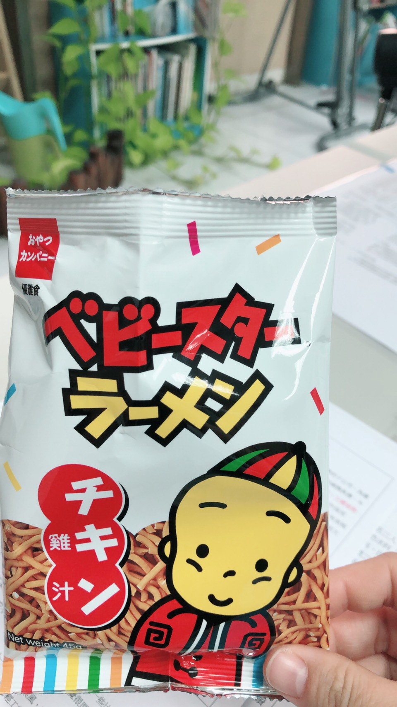

你可能有聽過大數據時代，沒有錯就是現在，所有人的身上都充滿的數據。我們今天就開始來量測自己一天的活動量，到底有多少。我們不用跟別人比較，每天發現自己的活動量提升，那就是一個小勝利。請你開始安裝Google fit 健或者是在蘋果上面的健康服務。大家一起來追蹤自己的身體消耗數值，從一大早就開始，多爬點樓梯多走點路，都是可以幫助消耗過多熱量的好活動。

> 我們致力於相互鼓勵追求理想身裁，以提升生活品質，歡迎[您點此按讚追蹤更多實用資訊](https://flyis.me/fffb)，或[點此報名加入計劃](https://flyis.me/joinfit)

### 小改變引發大影響

健身是件痛苦的事，但只在當你發現你努力很多，卻得到很少的時候，那更是一件很痛苦至極的事情，現在體脂卡在 15% 的我感覺很深。但是反過來說，當你發現努力一點，就可以得到很多的時候，那是不是非常開心呢?比如說走路，比如說爬樓梯，都是一個小小的改變，請相信這小改變，這對運動量少我很多你的身體，是有非常大的影響的，我是過來人去年4個月減了10%體脂。

### 雙腳萬能，世界遊起來

關於爬樓梯，我在前公司每次上廁所時，一定要往樓上爬去，可能是一層，可能是兩層，有時三層。還有碰過總經理，被問理由時，我直言是練身體。這場面挺怪的，我堅持下去了，讓身材保持得到現在。我們必須堅持自己覺得對的事情，且從每一步一腳印開始實踐。

關於走路，我特別推薦容易覺得無聊的人。為什麼說，單調的走路能推薦給容易覺得無聊的人。因為，一旦你發現，你每次都走不同條路的時候，你就會發現不同的風景。你甚至能轉過身來，再一次面對你剛才走過的路。你會發現，那居然也也是不一樣的風景。請你嘗試走不一樣的路，反過來走同一條路。再用各種不同的角度，來看看你經歷過的風景。這會是一個很棒的經驗，請多走路，用用無聊，用好奇心把平淡的路走得精彩。

如果你生活在都市中，走路能發現的親鮮事可多著。 你可以走路去買午餐，也可以散步去買食材。你可以到市場裡面晃一晃，與街坊鄰居交流生活經驗。你可以走路到隔壁商店打聲招呼。你可以做各種不必交通工具的事情。你可以藉無人打擾的環境來促進對自己的生命體悟，多走走路，對身心都好。

### 用訓練寫歷史

在做重量訓練的時候，記錄是件非常重要的事情。你也必須持續的突破自己的最大極限。若不方便用紙筆，那這時候用手機來快速記錄是再好也不過的。你每一回合都可以了解自己的極限在哪裡，你每次可以依照自己的體力來突破自己的極限，你每次可以用極限拿來當做完成一次訓練，你每次可能只為了保持自己的力量，堅持下去就不會退步。記錄訓練的歷程，就是寫一部自己的運動員史。我們一起來寫下歷史。

### 別忘初衷

記錄固然重要，但任何陌生人對你的第一印象，還是在他們的視網膜底。所以，與其過度記錄訓練，不如多多照照鏡子，甚至測量一下自己身體的變化，用皮尺量量手部肌肉，腹部，腿部。最終你必須要讓身體比例真的變好看，而不是只是盲目追求數字。對了，身裁是練來看的，一旦達到了八九成的目標，不妨多往社交場合去，或許你的理想伴侶也在那裡尋覓你。若是有伴的你，則帶上另個他，讓他以你的努力為豪。

開始記錄，樂於展現你的努力。

> 我們致力於相互鼓勵追求理想身裁，以提升生活品質，歡迎[您點此按讚追蹤更多實用資訊](https://flyis.me/fffb)，或[點此報名加入計劃](https://flyis.me/joinfit)
