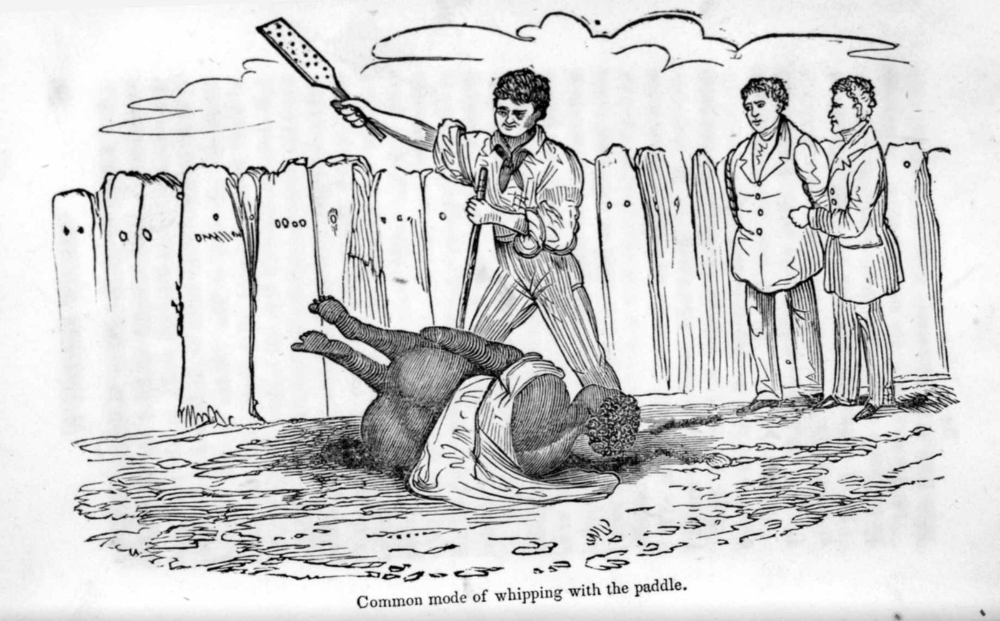

> 理想身裁設計師們致力於相互鼓勵追求理想身裁，以提升生活品質，歡迎[您點此按讚追蹤更多實用資訊](https://flyis.me/fffb)，或[點此報名加入計劃](https://flyis.me/joinfit)

理想身材計畫的初衷，是吸引親朋好友一起來體驗我曾經挑戰過的理想身材。目前，體脂肪15%的我，希望把這些健康生活的條件分享給大家。讓大家一起來設計自己的理想身材，你可以用輕便簡單的方式來達成目標。第一，運動規律。第二，飲食平衡。第三，堅持到底。就這麼簡單，一起來影響周遭的朋友獲得理想身材。今天，我們談談徒手深蹲，談談怎麼減輕訓練的痛苦，輕鬆達成目標，取得犒賞。

### \# 蹲就對了

徒手深蹲是一種不錯的自體重量訓練，人人幾乎無時不刻可做。簡單比喻接近的動作，例如：起身坐下的過程，就是一種類似深蹲的運動。練好深蹲，能讓我們身輕如燕。

我們每個人有不同的重量，所以不同的人下蹲這個動作會有不一樣的感覺。體重越重，我們做深蹲的時候越吃力。你想挑戰難度，可以蹲深一點，你想挑戰自己的耐力，你可以蹲久一點，你想試試更大強度的深蹲，這時候必須負重。各種不一樣變化的深蹲，都能帶來大腿前後側肌力的訓練。

深蹲有一些秘訣，抬頭挺胸縮下巴，膝蓋不要超過腳尖以免負擔過大。你必須把背挺直， 以免腰椎負擔過大。記住這些要點，然後對那張空氣椅子坐下。

深蹲能鍛鍊大腿並且促進雄性荷爾蒙分泌，有助於長肌肉，但女性也別擔心練得過壯，因為女生沒這麼容易長肌肉。

### \# 和自己遊戲

每一次的重量訓練，是一種空間與時間裡遊戲。由你帶著你的身體，帶著你的重量，在一定的時間內，移動了一定的距離。

在自體重量訓練中的重量，就是你的部分體重。不同的力矩，而有不同的重量。當你在做深蹲的時候你上半身就是你的負重，你的深蹲力矩越大，身體挺的越直，就會有更大的負荷。你可以試著貼在牆壁上做深蹲，或定住不動。這也是一個腿部耐力上面非常好的訓練。

### \# 苦樂相依

每一個訓練的過程，都應該是痛苦的。而且，我們應該慶幸痛苦是在訓練中，而不是在日常生活中。你會問，日常生活有一大堆的煩惱，夠我們受了。為何還要再訓練中增加自己痛苦呢？其實，這是一種模擬，模擬我們生活中要面對的痛苦。我們一旦能承受更多的痛苦，我們也必定能在生活中挑戰更多難以達成的事項。我們擬定較易達成的目標，我們更快速的達成目標，我們反應更快地迎接生活中更多的挑戰。這就是訓練的目的。

我建議理想身材設計師們，都能用自己的喜歡的音樂，來減低自己訓練時的痛苦。

對於時間寶貴的你，首推高強度間歇運動，HIIT 的音樂也有專門頻道

[https://www.youtube.com/watch?v=EgRsLyLb5jU](https://www.youtube.com/watch?v=EgRsLyLb5jU)

自己喜歡的音樂能帶來一個律動，能促進自己挑戰極限的能力。你必須要找到自己喜歡的音樂，跟著節奏不間斷的，在有限的體力，有限的時間內，達成空間與時間的目標，也就是突破自己負重與速度的極限。

說到重訓時的痛苦，那其實是指上肉體上還是會非常痛苦的不然也不會有這麼難看的表情。為了彌補這些痛苦帶來的失落感，你可以設定一些獎賞。我們就必須來仔細地，花更多的時間好好思考，怎麼樣的獎勵讓我們願意承受這些痛苦。他不能是金錢，因為金錢只是一個替代品，你拿金錢來換取什麼東西才是真正的獎賞。

### \# 犒賞自己的勇氣

在有許多情況下，獎賞是需要用到金錢才能取得的，獎賞明確的定義是，你花錢的勇氣。你平常不敢花的錢，在你達成目標之後，你就更能勇敢花下去，套一句保養品商的話「因為你值得」。突破目標就是接近更理想的自己，你更能讓自己花錢花得心安理得。挑戰目標，取得獎賞，因為達成目標後，去追求更高層次的理想生活。

每次聽到人性犯賤的說法，我都不得否認。覺得人仍有一些原始還沒進化的部份，像牲畜是需要鞭打才會前進的。但我認為更應該使用獎勵機制，來正向鼓勵人的進步。於是，獎賞的訂定，成為了理想身材設計成員一加入後的首要任務，每個人必需設定自己達成減重目標之後的獎勵。你是否已經設定好獎勵，並且能明確的跟大家宣揚了呢？

獎賞又分大小，任何取得獎賞的前提，都要有一些要素。舉個例子，我的一個要素是突破自己的記錄，這能算是一個小型目標，一但我突破紀錄了，我就可以吃一口香噴噴，充滿迷人斑點的香蕉，也一併快速的回覆自己在挑戰紀錄中辛苦損耗的體力。

### \# 為了獎賞，目標達成更容易

每個理想身材計畫的成員，都必須要有一個明確的目標，一個明確目標，一個明確目標，我們基本的設定是一個月減掉體脂肪1%。達成之後你應該也要有一個明確的獎賞，這個獎賞，可以是沙灘比基尼旅行，可以吃牽著你最愛的人，一起去冒險。每一個獎賞都該有他的意義，一口香蕉也有它的意義。

### \# 不為了獎賞，為了更好的自己

今天討論自體重量訓練以及痛苦，但最終極目的，是希望所有理想身材設計師們，都能不必去設計自己的獎賞，直接在訓練痛苦中得到理想的身材，這個讓自己更好的基本目標。更理想的是，都能更容易面對現實，去放下那一些生活中帶來的煩憂。我們一起從理想的身材之中找到最真實的自我，一起來影響更多人加入你想身材追求的行列。

### #理想身裁設計師日誌 3

### \# 雞蛋特價，我失心瘋

!\[\]([https://i.imgur.com/lSOnuOi.jpg](https://i.imgur.com/lSOnuOi.jpg))

### \# 成員分享營養量測知識

!\[\]([https://i.imgur.com/rzPbimi.jpg](https://i.imgur.com/rzPbimi.jpg))  
!\[\]([https://i.imgur.com/v7YyqGr.jpg](https://i.imgur.com/v7YyqGr.jpg))  
!\[\]([https://i.imgur.com/9G0drIw.jpg](https://i.imgur.com/9G0drIw.jpg))  
!\[\]([https://i.imgur.com/8H7dsix.jpg](https://i.imgur.com/8H7dsix.jpg))  
!\[\]([https://i.imgur.com/Cc4drv1.jpg](https://i.imgur.com/Cc4drv1.jpg))  
!\[\]([https://i.imgur.com/33qXkB1.jpg](https://i.imgur.com/33qXkB1.jpg))

### \# 一號餐：清爽、蛋白質足、試減飯量

!\[\]([https://i.imgur.com/CHd65VY.jpg](https://i.imgur.com/CHd65VY.jpg))

### \# 二號餐：過剩、大減糖、大減飯量

!\[\]([https://i.imgur.com/GkJt8KP.jpg](https://i.imgur.com/GkJt8KP.jpg))

### \# 三號餐：高原型、蛋白質足、試加纖維、減飯量

### \# 體能追蹤

Miss. 5 破萬步！恭喜，請持續突破，也能加強爬樓梯的段數。

Mr. 4 比目標進度快很多，建議下修目標到15%  
!\[\]([https://i.imgur.com/j0QyWE1.jpg](https://i.imgur.com/j0QyWE1.jpg))

### \# 犒賞

Miss. 5，運動完紅酒一杯，確有其說。  
[https://kknews.cc/health/ne6k852.html](https://kknews.cc/health/ne6k852.html)

> 歐洲心臟病學會研究指出

> 1.運動後飲用葡萄酒，大腦能釋放出更多的內啡肽，而這些內啡肽能激勵我們繼續運動。

> 2.葡萄酒既能減緩現有脂肪細胞的生長，也能延緩新的脂肪細胞形成，甚至還能促進肝細胞脂肪酸的代謝，若將運動與葡萄酒相結合，更能將體內的脂肪燃燒。

> 3.人體在運動之後，需要攝取一定量的抗氧化物質，而葡萄酒當中的白藜蘆醇，是非常棒的天然抗氧化物質。

> 實驗證明，一名健身愛好者，每日需要攝入250毫克白藜蘆醇，以此來維持身體不出現劇烈的氧化應激反應。研究還指出，一周至少喝2次葡萄酒的人，在運動時，體內的葡萄酒更能降低膽固醇水平，即葡萄酒結合鍛鍊更有利於預防心血管病。

紅酒對身體些真有這影響？有機會我也要來試試！快來約我喝酒！但也先等我再破一個PR(personal record 個人記錄)

> 理想身裁設計師們致力於相互鼓勵追求理想身裁，以提升生活品質，歡迎[您點此按讚追蹤更多實用資訊](https://flyis.me/fffb)，或[點此報名加入計劃](https://flyis.me/joinfit)
